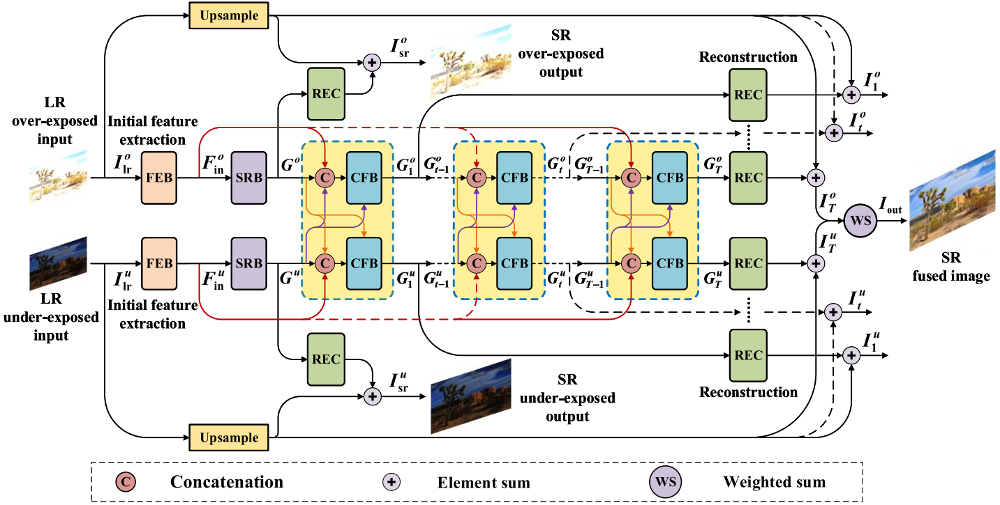

# CF-Net : Deep Coupled Feedback Network for Joint Exposure Fusion and Image Super-Resolution
- This is the official repository of the paper "Deep Coupled Feedback Network for Joint Exposure Fusion and Image Super-Resolution" from **IEEE Transactions on Image Processing 2021**. [[Paper Link]](https://ieeexplore.ieee.org/abstract/document/9357931, "Paper Link")[[PDF Link]](https://ieeexplore.ieee.org/stamp/stamp.jsp?tp=&arnumber=9357931)
- We have conducted a live streaming on Extreme Mart Platform, the Powerpoint file can be downloaded from [[PPT Link]](https://kdocs.cn/l/coxDwl57PbVi
).



## 1. Environment
- Python >= 3.5
- PyTorch >= 0.4.1 is recommended
- opencv-python
- pytorch-msssim
- tqdm
- Matlab

## 2. Dataset
The training data and testing data is from the [[SICE dataset]](https://github.com/csjcai/SICE, "Official SICE"). Or you can download the datasets from our [[Google Drive Link]](https://drive.google.com/drive/folders/1Ik0D2pf93aLOlexevpAE5ftckMTQscZo?usp=sharing., "Ours").

## 3. Test
1. Clone this repository:
    ```
    git clone https://github.com/ytZhang99/CF-Net.git
    ```
2. Place the low-resolution over-exposed images and under-exposed images in `dataset/test_data/lr_over` and `dataset/test_data/lr_under`, respectively.
3. Run the following command for 2 or 4 times SR and exposure fusion:
    ```
    python main.py --test_only --scale 2 --model model_x2.pth
    python main.py --test_only --scale 4 --model model_x4.pth
    ```
4. Finally, you can find the Super-resolved and Fused results in `./test_results`.

## 4. Training
### Preparing training and validation data
1. Place HR_groundtruth, HR_over_exposed, HR_under_exposed images for training in the following directory, respectively. (Optional) Validation data can also be placed in `dataset/val_data`. 
    ```
    dataset 
    ├── train_data
        ├── hr
        ├── hr_over
        └── hr_under
    └── val_data
        ├── gt
        ├── lr_over
        └── lr_under
    ```                
2. Open `Prepare_Data_HR_LR.m` file and modify the following lines according to your training commands.
    ```
    Line 5 or 6 : scale = 2 or 4
    Line 9 : whether use off-line data augmentation (default = True)
    [Line 12 <-> Line 17] or [Line 13 <-> Line 18] : producing [lr_over/lr_under] images from [hr_over/hr_under] images
    ```
3. After the above operations, `dataset/train_data` should be as follows:
    ```
    dataset
    └── train_data 
        ├── hr
        ├── hr_over
        ├── hr_under
        ├── lr_over
        └── lr_under
    ```
### Training
1. Place the attached files `dataset.py` and `train.py` in the same directory with `main.py`.
2. Run the following command to train the network for scale=2 or 4 according to the training data.
    ```
    python main.py --scale 2 --model my_model
    python main.py --scale 4 --model my_model
    ```
    If validation data is added, run the following command to get the best model `best_ep.pth`.
    ```
    python main.py --scale 2 --model my_model -v
    python main.py --scale 4 --model my_model -v
    ```
3. The trained model are placed in the directory `./model/`.

## 5. Citation
If you find our work useful in your research or publication, please cite our work:
```
@article{deng2021deep,
  title={Deep Coupled Feedback Network for Joint Exposure Fusion and Image Super-Resolution.},
  author={Deng, Xin and Zhang, Yutong and Xu, Mai and Gu, Shuhang and Duan, Yiping},
  journal={IEEE Transactions on Image Processing: a Publication of the IEEE Signal Processing Society},
  year={2021}
}
```

## 6. Contact
If you have any question about our work or code, please email `yutongzhang@buaa.edu.cn` .
